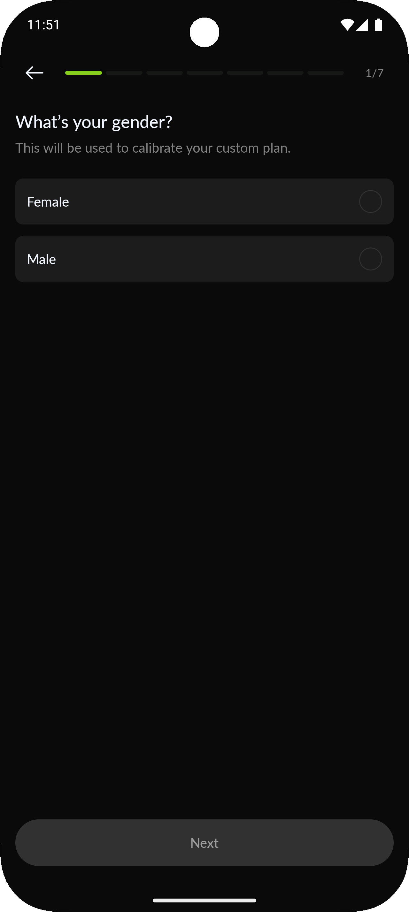
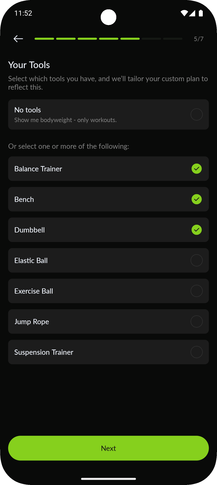
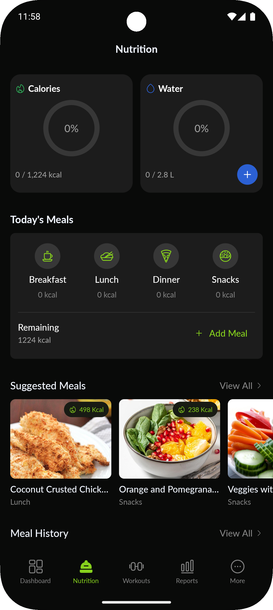

<p align="center">
    <p align="center">
   EvolveFit A gym tracking app built with Kotlin Multiplatform for Android and iOS. Track workouts , monitor progress , and achieve your fitness goals!
  </p>
  <br>
</p>

## Architecture
This project is based on a Kotlin Multiplatform (KMP) architecture with shared business logic between Android and iOS.

## Technologies
> [!TIP]
> - KMP
> - cmp
> - Room Database
> - Koin
> - Coil
> - Ktor
> - Navigation 2(Type Safe)

## Features
### OnBoarding
| On Boarding 1                                                                                                                                                                                                                                 |
|------------------------------------------------------------------------------------------------------------------------------------------|--------------------------------------------------------------------------------------------------------------------------------------------|
|


### Authentication
                                                                                                                          Sign up                                                                                                                                                                                                                                                      |
|------------------------------------------------------------------------------------------------------------------------------------|-------------------------------------------------------------------------------------------------------------------------------------|----------------------------------------------------------------------------------------------------------------------------------------------|
|  | 

### Home Screen
| Home                                                                                                                                                                                                                                                                                                                                                                                          |
|------------------------------------------------------------------------------------------------------------------------------------------|--------------------------------------------------------------------------------------------------------------------------------------------|----------------------------------------------------------------------------------------------------------------------------------------------|
|  |   |
> [!Note]|

> - **Weakly Progress**: View your workout progress over the week.
> - **Today's Nutrition**:Track your water intake and calorie consumption for the day.
> - **Just For You**:Discover personalized workouts tailored to your goals.


### 🥗 Nutrition
| Nutrition                                                                                                                            | Add Meal                                                                                                                            | Add Water                                                                                                                           | Suggested Meals                                                                                                                              |
|--------------------------------------------------------------------------------------------------------------------------------------|-------------------------------------------------------------------------------------------------------------------------------------|---------------------------------------------------------------------------------------------------------------------------------------------|--------------------------------------------------------------------------------------------------------------------------------------|
|  |  |  |  |
[!Note]
Nutrition: Overview of your daily nutrient and calorie progress.

Add Meal: log your meals with amount of calories.

Add Water: Stay hydrated by recording your daily water intake.

Suggested Meals: meal recommendations.

### Suggested Meals
<table>
  <thead>
    <tr>
      <th>Suggested Meals</th>
    </tr>
  </thead>
  <tbody>
    <tr>
      <td>
        
      </td>
    </tr>
  </tbody>
</table>

#### Meal Details:
> **_Displays all the details about the Meal_**
<table>
  <thead>
    <tr>
      <th>Tv Meal details </th>
    </tr>
  </thead>
  <tbody>
    <tr>
      <td>
        
      </td>
    </tr>
  </tbody>
</table>


### Workout:
|Wokout                                                                                                                           | Create Exercise                                                                                                                            | Community                                                                                                                           | Add Exercise                                                                                                                             | Create Workout                                                                                                                             |
|--------------------------------------------------------------------------------------------------------------------------------------------|------------------------------------------------------------------------------------------------------------------------------------------------|------------------------------------------------------------------------------------------------------------------------------------|----------------------------------------------------------------------------------------------------------------------------------------|--------------------------------------------------------------------------------------------------------------------------------------|
|  |  |  |  |  |
> [!Note]
>
> - Displays all of your lists, favorite items and your watch history.
> - Check the lists you have and the items inside of it.
> - Display all of your favorite movies and tv shows.
> - Display your watch history for everything you have watched.


### Profile Screen:
| Profile (Guest)                                                                                                                            | Profile (Logged In)                                                                                                                            | Theme Switch                                                                                                                              | Language Change                                                                                                                              |
|--------------------------------------------------------------------------------------------------------------------------------------------|------------------------------------------------------------------------------------------------------------------------------------------------|-------------------------------------------------------------------------------------------------------------------------------------------|----------------------------------------------------------------------------------------------------------------------------------------------|
|  |  |  |  |
> [!Note]
>
> - You displays your image and user name.
> - Can change the application theme to light or dark.
> - Can switch easily the language of the application to arabic or english.


### My Ratings:
| Rating Empty                                                                                                                              | Rating filled                                                                                                                              |
|-------------------------------------------------------------------------------------------------------------------------------------------|--------------------------------------------------------------------------------------------------------------------------------------------|
|  |  |
> [!Note]
>
> - You can easily know what series or movies you have rated.
> - Easily to remove the item you don't want by swiping it.


---
## Installation
1- Clone the Repository
```
git clone https://github.com/Cairo-Squad/EvolveFit.git
```
2- open the project in android studio.
3- Add the required parameters in `local.properties` file.
4- Build and run the project on an emulator or physical device.

## 👥 Contributors
<a href="https://github.com/Cairo-Squad/EvolveFit/graphs/contributors">
  
</a>