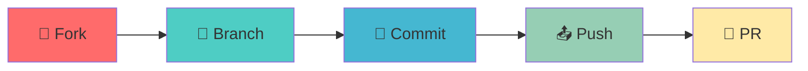

# 💪 EvolveFit

<div align="center">


**🏋️ A comprehensive gym tracking app built with Kotlin Multiplatform**  
*Track workouts • Monitor progress • Achieve your fitness goals*

[](https://kotlinlang.org)
[](https://www.jetbrains.com/compose/)
[](LICENSE)
[](https://github.com/Cairo-Squad/EvolveFit/graphs/contributors)

</div>

---

## 🏗️ Architecture & Technology Stack

<div align="center">

**Built with modern technologies for optimal performance**

</div>

### 🔧 Core Technologies
```
🎯 Kotlin Multiplatform (KMP)     📱 Compose Multiplatform
🗄️ Room Database                  🔗 Koin Dependency Injection
🖼️ Coil Image Loading             🌐 Ktor Networking
🧭 Type-Safe Navigation 2          
```

---

## ✨ Features Overview

### 🚀 **OnBoarding Experience**
<div align="center">

</div>

### 🔐 **Seamless Authentication**
<div align="center">


</div>

### 🏠 **Smart Home Dashboard**
<div align="center">

</div>

> **🎯 Key Features:**
> - **📊 Weekly Progress** - Visualize your workout journey over time
> - **🍎 Today's Nutrition** - Monitor water intake and calorie consumption  
> - **✨ Personalized Workouts** - AI-curated routines tailored to your goals

---

## 🥗 Nutrition Tracking

<div align="center">

**Complete nutrition management at your fingertips**


</div>

### 🍽️ **Smart Meal Suggestions**

<div align="center">


**📋 Detailed Meal Information**


</div>

---

## 💪 Workout Management

<div align="center">

**Your personal trainer in your pocket**

</div>

<table align="center">
<tr>
<td align="center">

<br><b>📋 Workout Plans</b>
</td>
<td align="center">

<br><b>🏃 Exercise Library</b>
</td>
<td align="center">

<br><b>📖 Exercise Guide</b>
</td>
</tr>
<tr>
<td align="center">

<br><b>📈 Progress Tracking</b>
</td>
<td align="center">

<br><b>⏱️ Workout Timer</b>
</td>
</tr>
</table>

---

## 👤 Profile & Customization

<div align="center">

**Personalize your fitness experience**

</div>

<table align="center">
<tr>
<td align="center">

<br><b>⚙️ Settings Hub</b>
</td>
<td align="center">

<br><b>👤 Profile Info</b>
</td>
<td align="center">

<br><b>🌙 Dark Theme</b>
</td>
<td align="center">

<br><b>☀️ Light Theme</b>
</td>
</tr>
</table>

---

## 🚀 Getting Started

<div align="center">

**Ready to transform your fitness journey?**

</div>

### 📥 **Installation Steps**

```bash
# 1️⃣ Clone the repository
git clone https://github.com/Cairo-Squad/EvolveFit.git

# 2️⃣ Open in Android Studio
# Launch Android Studio and open the project

# 3️⃣ Configure environment
# Add required parameters in local.properties file

# 4️⃣ Build and run
# Deploy to emulator or physical device
```

---

## 🤝 Join Our Community

<div align="center">

**Help us make fitness accessible for everyone!**

[](CONTRIBUTING.md)
[](https://github.com/Cairo-Squad/EvolveFit/issues?q=is%3Aissue+is%3Aopen+label%3A%22good+first+issue%22)
[](https://discord.gg/your-discord)

</div>

### 🛠️ **How to Contribute**

<div align="center">



</div>

1. **🍴 Fork** the repository to your GitHub account
2. **🌿 Create** your feature branch (`git checkout -b feature/amazing-feature`)
3. **💾 Commit** your changes with descriptive messages
4. **📤 Push** to your forked repository
5. **🎯 Open** a Pull Request with detailed description

---

## 👥 Meet Our Team

<div align="center">

[](https://github.com/Cairo-Squad/EvolveFit/graphs/contributors)

**💖 Made with passion by the Cairo Squad**  
*Dedicated developers revolutionizing fitness technology*

</div>

---

## 🌟 Show Your Support

<div align="center">

**Love EvolveFit? Show us some love!**

[](https://github.com/Cairo-Squad/EvolveFit)
[](https://github.com/Cairo-Squad/EvolveFit/network)
[](https://github.com/Cairo-Squad/EvolveFit/watchers)

**⭐ Star this repository if it helped you on your fitness journey!**

<br>

*🚀 Evolving fitness technology, one commit at a time*

<br>

[](https://github.com/Cairo-Squad/EvolveFit)
[](https://kotlinlang.org)
[](https://en.wikipedia.org/wiki/Cairo)

</div>
